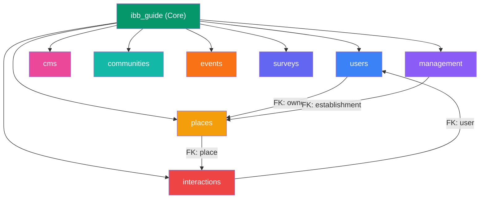
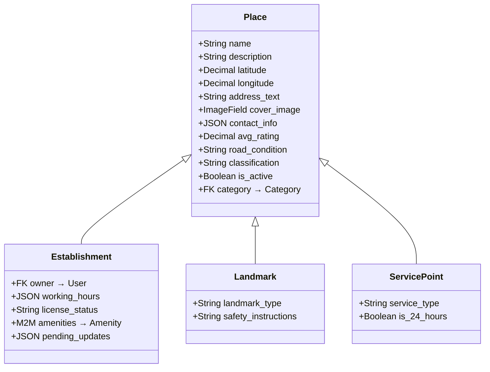
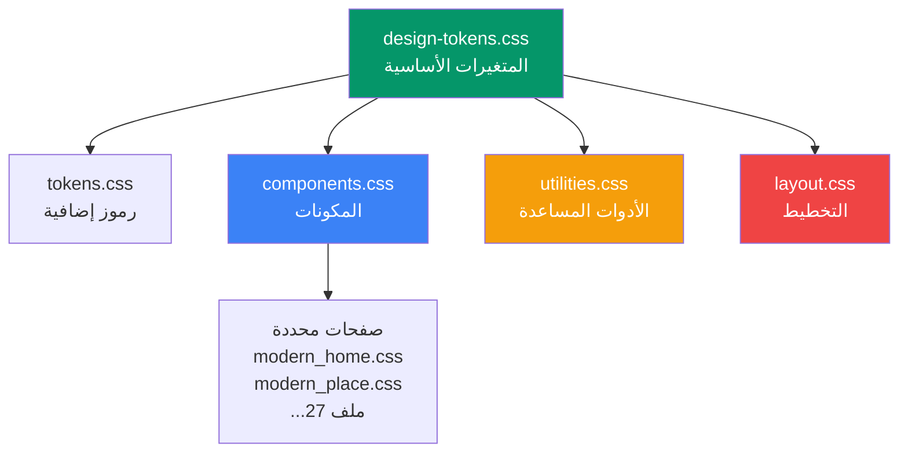
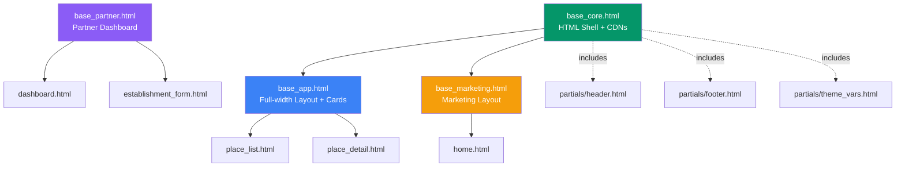
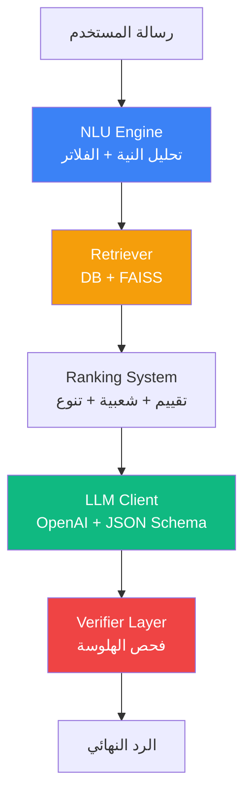
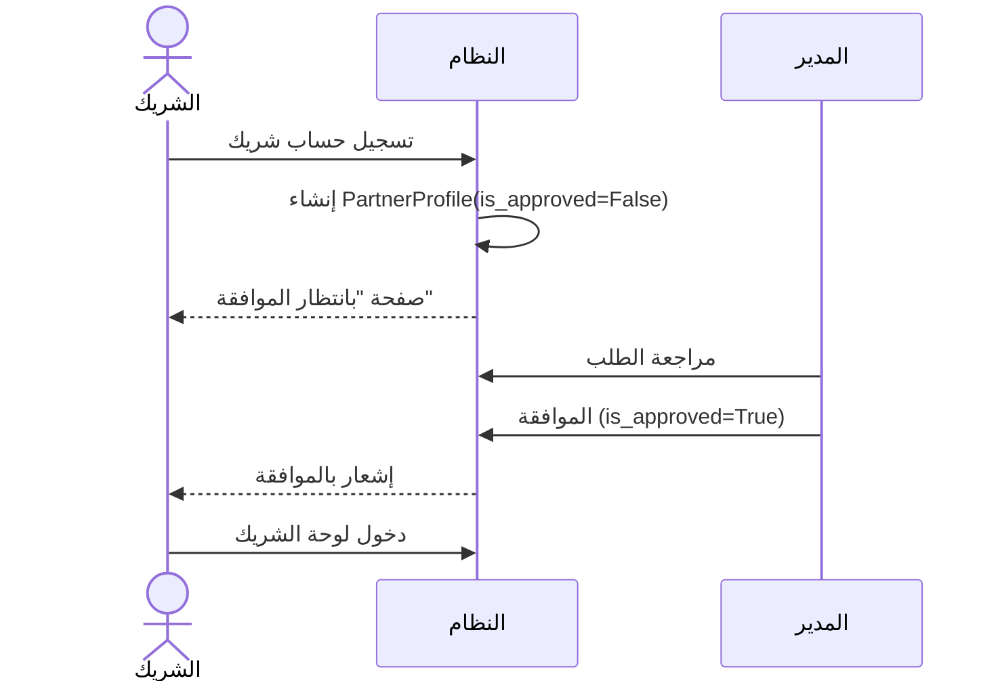
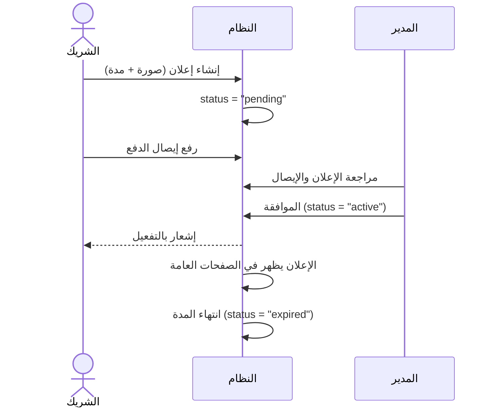

# التحليل الأكاديمي الشامل لمشروع "دليل إب السياحي"

## Comprehensive Academic Analysis – Ibb Tourist Guide

---

## 1. المقدمة ونطاق التحليل

مشروع **دليل إب السياحي** هو منصة سياحية شاملة مبنية بإطار عمل **Django 4.2** تهدف إلى خدمة منطقة إب في اليمن. يقدم المشروع نظامًا مزدوج الأطراف:

- **السائح**: استكشاف الأماكن والخدمات والفعاليات
- **الشريك (صاحب المنشأة)**: إدارة المنشآت والحجوزات والإعلانات

> [!NOTE]
> يغطي هذا التحليل الأكاديمي: البنية المعمارية، تصميم واجهة المستخدم (UI/UX)، قاعدة البيانات، أنماط التصميم البرمجي، الأمان، واجهات API، والبنية التحتية للنشر.

---

## 2. الحزمة التقنية (Technology Stack)

| الطبقة             | التقنية                          | الإصدار         | الغرض                  |
| ------------------ | -------------------------------- | --------------- | ---------------------- |
| Backend Framework  | Django                           | 4.2.27          | إطار العمل الأساسي     |
| REST API           | Django REST Framework            | 3.16.1          | واجهة برمجة التطبيقات  |
| Authentication     | SimpleJWT + allauth              | 5.5.1 / 65.13.1 | JWT + OAuth (Google)   |
| Task Queue         | Celery + Redis                   | 5.3.6 / 5.0.1   | المهام غير المتزامنة   |
| Database           | SQLite (Dev) / PostgreSQL (Prod) | -               | تخزين البيانات         |
| Frontend CSS       | Bootstrap 5 RTL                  | 5.3.0           | إطار عمل CSS           |
| Frontend JS        | HTMX                             | 1.9.10          | تفاعلية بدون SPA       |
| Icons              | FontAwesome                      | 6.4.0           | الأيقونات              |
| Typography         | Google Fonts (Tajawal)           | -               | خط عربي احترافي        |
| Animations         | Animate.css                      | 4.1.1           | حركات دخول العناصر     |
| PWA                | Service Worker + Manifest        | -               | تطبيق ويب تقدمي        |
| Push Notifications | OneSignal SDK v16                | -               | الإشعارات الفورية      |
| Forms              | Crispy Forms + Bootstrap 5       | 2025.6          | نماذج محسّنة           |
| Admin              | Jazzmin                          | 3.0.1           | لوحة إدارة محسّنة      |
| Security           | django-axes + ratelimit          | 7.0.1 / 4.1.0   | حماية من الهجمات       |
| Deployment         | Gunicorn + WhiteNoise            | 21.2.0 / 6.6.0  | خادم الإنتاج           |
| Code Quality       | import-linter + pytest           | 2.0 / 8.0.0     | جودة الكود والاختبارات |

---

## 3. البنية المعمارية (Architecture)

### 3.1 هيكل التطبيقات (App Structure)



### 3.2 وصف التطبيقات

| التطبيق        | المسؤولية                                   | عدد النماذج                                                                                         | عدد العروض |
| -------------- | ------------------------------------------- | --------------------------------------------------------------------------------------------------- | ---------- |
| `users`        | المصادقة، الملفات الشخصية، RBAC             | 4 (User, PartnerProfile, Role, JobPosition)                                                         | 6+         |
| `places`       | الأماكن السياحية بأنواعها                   | 6+ (Place, Establishment, Landmark, ServicePoint, Category, Amenity, PlaceMedia, EstablishmentUnit) | 10+        |
| `interactions` | التفاعلات (مراجعات، مفضلة، بلاغات، إشعارات) | 10+ (Favorite, Itinerary, Review, Report, Notification, LiveShareSession...)                        | 15+        |
| `management`   | الإدارة والأعمال (إعلانات، استثمارات، طقس)  | 6+ (Advertisement, Request, InvestmentOpportunity, WeatherAlert, AuditLog)                          | 8+         |
| `cms`          | إدارة المحتوى والقوائم الديناميكية          | 3+ (UIZone, ZoneComponent, UIComponent)                                                             | 3+         |
| `communities`  | المجتمعات والمناقشات                        | 3+                                                                                                  | 4+         |
| `events`       | الفعاليات والمواسم                          | 2+                                                                                                  | 4+         |
| `surveys`      | الاستبيانات واستطلاعات الرأي                | 3+                                                                                                  | 3+         |

### 3.3 الطبقة المركزية (Core Layer – `ibb_guide`)

يحتوي المشروع على طبقة مركزية متقدمة:

| الملف/المجلد                      | الغرض                                        |
| --------------------------------- | -------------------------------------------- |
| `base_models.py`                  | نماذج أساسية مشتركة (Timestamped, Slugged)   |
| `mixins.py`                       | Mixins مشتركة للعروض (Ownership, Pagination) |
| `validators.py`                   | موّحدات التحقق المخصصة                       |
| `policies.py`                     | سياسات الأعمال المركزية                      |
| `events.py` + `event_handlers.py` | نظام الأحداث (Domain Events)                 |
| `domain/`                         | طبقة المجال (Domain Layer)                   |
| `use_cases/`                      | حالات الاستخدام (Use Cases)                  |
| `services/`                       | خدمات الأعمال المشتركة                       |
| `security/`                       | طبقة الأمان المركزية                         |
| `infrastructure/`                 | البنية التحتية                               |
| `settings/`                       | إعدادات مقسمة حسب البيئة                     |

> [!IMPORTANT]
> وجود طبقات `domain/`، `use_cases/`، `services/` يشير إلى تطبيق مبادئ **Clean Architecture** و**Domain-Driven Design (DDD)** بشكل جزئي، وهو نمط معماري متقدم نادرًا ما يُرى في مشاريع Django الأكاديمية.

---

## 4. تحليل قاعدة البيانات (Database Analysis)

### 4.1 نمط الوراثة (Inheritance Pattern)



**النمط المستخدم**: Multi-Table Inheritance (وراثة متعددة الجداول)

- **المزايا**: حقول مشتركة في جدول واحد، حقول متخصصة في جداول فرعية، سهولة إضافة أنواع جديدة
- **المقايضات**: يتطلب JOIN عند الاستعلام، أعقد من Single-Table Inheritance

### 4.2 أنماط التصميم في قاعدة البيانات

| النمط                   | التطبيق                                                              | الفائدة                      |
| ----------------------- | -------------------------------------------------------------------- | ---------------------------- |
| **JSONField**           | `contact_info`, `working_hours`, `pending_updates`, `old/new_values` | مرونة Schema، بيانات متداخلة |
| **Unique Together**     | `(user, place)` في Review و Favorite                                 | منع التكرار                  |
| **Soft Delete**         | `is_active`, `is_hidden`                                             | حفظ البيانات للتحليل         |
| **Generic Relations**   | Notification → ContentType                                           | ربط مرن بأي نموذج            |
| **Denormalized Fields** | `avg_rating` في Place                                                | تجنب N+1 queries             |
| **Approval Workflow**   | `pending_updates` JSONField                                          | سير عمل موافقات الإدارة      |
| **Audit Trail**         | `AuditLog` (CREATE/UPDATE/DELETE)                                    | تتبع كل التغييرات            |

---

## 5. تحليل واجهة المستخدم (UI/UX Analysis)

### 5.1 نظام التصميم (Design System)

يعتمد المشروع على نظام تصميم احترافي متعدد الطبقات:



### 5.2 Design Tokens – رموز التصميم

يحتوي ملف `design-tokens.css` على **10 فئات** من المتغيرات:

| الفئة             | عدد المتغيرات | أمثلة                                                     |
| ----------------- | ------------- | --------------------------------------------------------- |
| **Color Palette** | 25+           | `--color-primary-500: #10b981` (أخضر زمردي)               |
| **Typography**    | 15+           | خط Tajawal العربي، Fluid Typography عبر `clamp()`         |
| **Spacing**       | 14            | نظام شبكة 8px (`--space-1: 0.25rem` → `--space-24: 6rem`) |
| **Border Radius** | 8             | من `--radius-sm: 6px` إلى `--radius-full: 9999px`         |
| **Shadows**       | 8+            | ظلال عادية + ظلال ملونة (Primary Shadow)                  |
| **Transitions**   | 4             | `--transition-fast: 150ms` → `--transition-slower: 500ms` |
| **Z-Index**       | 7             | مقياس من `dropdown:100` إلى `tooltip:700`                 |
| **Breakpoints**   | 5             | `640px` → `1536px`                                        |
| **Layout**        | 5+            | `--header-height: 72px`, `--sidebar-width: 280px`         |
| **Components**    | 10+           | رموز Cards, Buttons, Inputs, Badges                       |

> [!TIP]
> استخدام **Fluid Typography** عبر `clamp()` يُعد ممارسة حديثة متقدمة تضمن تكيف الخطوط تلقائيًا مع أحجام الشاشات المختلفة دون الحاجة لـ media queries منفصلة.

### 5.3 هرمية القوالب (Template Hierarchy)



**إحصائيات القوالب**:

- إجمالي القوالب: **210+ ملف**
- مجلدات القوالب: **18 مجلد**
- قوالب الشركاء: **34 ملف** (أكبر مجموعة)
- قوالب لوحة الإدارة: **15 ملف**
- صفحات المحتوى: **15 صفحة** (about, emergency, transport, culture, food...)

### 5.4 Atomic Design – التصميم الذري

يتبع المشروع نمط **Atomic Design** في تنظيم المكونات:

| المستوى                | الموقع                  | الأمثلة                                                                                            |
| ---------------------- | ----------------------- | -------------------------------------------------------------------------------------------------- |
| **Atoms** (ذرات)       | `components/atoms/`     | `badge.html`, `button.html`, `input.html`, `skeleton_loader.html`                                  |
| **Molecules** (جزيئات) | `components/molecules/` | `place_card.html`, `stat_card.html`, `hero_section.html`, `weather_widget.html`, `bottom_nav.html` |
| **Organisms** (كائنات) | `partials/`             | `header.html`, `footer.html`, `right_sidebar.html`                                                 |
| **Templates** (قوالب)  | `base_*.html`           | `base_app.html`, `base_partner.html`, `base_marketing.html`                                        |
| **Pages** (صفحات)      | `pages/`, جذر templates | `home.html`, `place_list.html`, `about.html`                                                       |

> [!NOTE]
> **Atomic Design** هو منهجية صممها Brad Frost (2013) لبناء واجهات مستخدم منظمة وقابلة لإعادة الاستخدام. تطبيقها هنا يدل على نضج هندسي في تصميم الواجهة الأمامية.

### 5.5 التصميم المتجاوب (Responsive Design)

```
┌────────────────────────────────────┐
│ الأجهزة الكبيرة (≥1200px)         │ → 5 أعمدة بطاقات
│ أجهزة سطح المكتب (≥992px)        │ → 4 أعمدة + sidebar
│ الأجهزة اللوحية (≥768px)          │ → 3 أعمدة
│ الأجهزة الصغيرة (≥576px)          │ → عمودان
│ الهواتف (<576px)                  │ → عمود واحد + Bottom Nav
└────────────────────────────────────┘
```

**مميزات التجاوب**:

- نظام شبكة CSS Grid متدرج (1→5 أعمدة)
- Container مخصص (`container-custom`) مع breakpoints متعددة
- شريط تنقل سفلي للموبايل (`mobile-bottom-nav`)
- زر FAB للطوارئ (SOS) على الموبايل فقط
- بحث منفصل لسطح المكتب والموبايل
- Horizontal Scroller للبطاقات

### 5.6 دعم RTL والعربية

| الميزة             | التنفيذ                                           |
| ------------------ | ------------------------------------------------- |
| اتجاه الصفحة       | تلقائي عبر `dir="rtl/ltr"` بناءً على اللغة        |
| Bootstrap RTL      | `bootstrap.rtl.min.css`                           |
| الخط العربي        | Tajawal (Google Fonts) بـ 5 أوزان (300-800)       |
| الترجمة            | Django i18n عبر `` و `` |
| اللغة الافتراضية   | العربية (`ar`)، مع دعم الإنجليزية (`en`)          |
| التعليقات بالعربية | CSS و Python يحتويان تعليقات عربية                |

### 5.7 تقنيات التفاعل (Interactivity)

| التقنية             | الاستخدام                                                          |
| ------------------- | ------------------------------------------------------------------ |
| **HTMX**            | بحث فوري (Global Search) مع debounce 300-500ms، تحديث جزئي للصفحات |
| **Bootstrap 5 JS**  | Dropdowns, Modals, Alerts, Collapse, Tooltips                      |
| **Animate.css**     | حركات دخول العناصر (`fadeInDown`, `fadeInUp`)                      |
| **CSS Transitions** | تأثيرات hover على البطاقات (`translateY(-4px)`, `scale(1.05)`)     |
| **AJAX**            | Toggle المفضلة، تحديث الإشعارات                                    |

### 5.8 البنية الأمامية لـ JavaScript

```
static/js/
├── admin.js              ← وظائف لوحة الإدارة
├── core/                 ← الوحدات الأساسية
│   ├── http.js           ← طبقة HTTP مع CSRF
│   ├── ui.js             ← أدوات واجهة المستخدم
│   ├── features.js       ← Feature Flags
│   ├── notifications.js  ← إدارة الإشعارات
│   └── places_interactions.js  ← تفاعلات الأماكن
└── pages/                ← سكربتات الصفحات
```

**Global APP Object**:

```javascript
window.APP = {
  csrf: "{{ csrf_token }}", // حماية CSRF
  features: JSON.parse("..."), // Feature Flags
  onesignalAppId: "...", // Push Notifications
  urls: { autosave: "" }, // Dynamic URLs
};
```

> [!IMPORTANT]
> استخدام **Feature Flags** يتيح تفعيل/تعطيل الميزات دون إعادة النشر، وهو نمط هندسي متقدم شائع في أنظمة الإنتاج الكبرى.

---

## 6. تحليل الأمان (Security Analysis)

### 6.1 طبقات الأمان

```mermaid
graph LR
    A["المستخدم"] --> B["Rate Limiting<br/>django-ratelimit"]
    B --> C["Brute Force Protection<br/>django-axes"]
    C --> D["Authentication<br/>Session + JWT"]
    D --> E["Authorization<br/>RBAC + Object-Level"]
    E --> F["CSRF Protection<br/>Middleware"]
    F --> G["Input Validation<br/>Django Forms"]
    G --> H["Audit Logging<br/>AuditLog Model"]

    style B fill:#ef4444,color:#fff
    style C fill:#f59e0b,color:#fff
    style D fill:#10b981,color:#fff
    style E fill:#3b82f6,color:#fff
    style F fill:#8b5cf6,color:#fff
```



### 6.2 تفاصيل الأمان

| الطبقة                  | التنفيذ                                                        | التقييم     |
| ----------------------- | -------------------------------------------------------------- | ----------- |
| **المصادقة**            | نظام مزدوج: Session (Web) + JWT (API)                          | ✅ ممتاز    |
| **التفويض**             | RBAC + `UserPassesTestMixin` (Object-Level)                    | ✅ جيد جدًا |
| **حماية CSRF**          | `CsrfViewMiddleware` + `` + HTMX headers       | ✅ شامل     |
| **حماية القوة الغاشمة** | `django-axes` لتتبع محاولات تسجيل الدخول الفاشلة               | ✅ متقدم    |
| **تحديد المعدل**        | `django-ratelimit`                                             | ✅ موجود    |
| **التحقق من الملفات**   | `ImageField` مع upload paths منظمة                             | ✅ جيد      |
| **سجل التدقيق**         | `AuditLog` يسجل CREATE/UPDATE/DELETE مع القيم القديمة والجديدة | ✅ احترافي  |
| **إشراف المحتوى**       | نظام بلاغات + `is_hidden` + ModerationQueue                    | ✅ شامل     |

---

## 7. واجهات API (API Analysis)

### 7.1 بنية RESTful

| الـ Endpoint          | الفعل           | الوصف                 | المصادقة      |
| --------------------- | --------------- | --------------------- | ------------- |
| `/api/places/`        | GET/POST        | قائمة/إنشاء الأماكن   | JWT (POST)    |
| `/api/places/{id}/`   | GET/PUT/DELETE  | تفاصيل/تعديل/حذف      | JWT           |
| `/api/reviews/`       | GET/POST        | قائمة/إنشاء المراجعات | JWT (POST)    |
| `/api/favorites/`     | GET/POST/DELETE | إدارة المفضلة         | JWT           |
| `/api/reports/`       | GET/POST        | تقديم البلاغات        | JWT           |
| `/api/auth/register/` | POST            | تسجيل مستخدم جديد     | عام           |
| `/api/auth/login/`    | POST            | تسجيل الدخول (JWT)    | عام           |
| `/api/auth/refresh/`  | POST            | تجديد Token           | Refresh Token |

### 7.2 خصائص API

- **Pagination**: `PageNumberPagination` مع `PAGE_SIZE=10`
- **Filtering**: `DjangoFilterBackend` + `SearchFilter`
- **Serializers**: مخصصة لكل نموذج مع بيانات مرتبطة
- **Router**: DRF DefaultRouter للتسجيل التلقائي

---

## 8. نظام Chatbot (RAG Architecture)

### 8.1 الهيكل الهجين



**الفصل بين القرار والصياغة**:

- طبقة القرار (NLU + Retriever): حتمية، قائمة على القواعد
- طبقة الصياغة (LLM): توليدية، مقيدة بالبيانات المسترجعة فقط
- طبقة التحقق: تمنع الهلوسة عبر مطابقة الأرقام والأسماء

---

## 9. الميزات المتقدمة

| الميزة                 | الوصف                                      | التقنية                                  |
| ---------------------- | ------------------------------------------ | ---------------------------------------- |
| **PWA**                | تطبيق ويب تقدمي مع Service Worker          | `manifest.json` + `serviceworker.js`     |
| **Push Notifications** | إشعارات فورية حتى خارج الموقع              | OneSignal SDK v16                        |
| **Live Location**      | مشاركة الموقع المباشر                      | `LiveShareSession` + `LiveLocationPing`  |
| **Itinerary Planner**  | جدولة الرحلات                              | `Itinerary` + `ItineraryItem`            |
| **CMS**                | إدارة محتوى ديناميكية مع Interface Control | `UIZone`, `ZoneComponent`, `UIComponent` |
| **Weather Alerts**     | تنبيهات طقس بمستويات خطورة                 | Yellow/Orange/Red + Polygon              |
| **Investment Portal**  | فرص استثمارية مع ملفات PDF                 | `InvestmentOpportunity`                  |
| **Community**          | مجتمعات ومناقشات                           | `communities` app                        |
| **Surveys**            | استبيانات واستطلاعات                       | `surveys` app                            |
| **Events**             | فعاليات ومواسم                             | `events` app                             |
| **Gamification**       | نظام نقاط وإنجازات                         | ضمن `interactions`                       |

---

## 10. أنماط التصميم المستخدمة (Design Patterns)

| النمط                         | الموقع                                      | الشرح                         |
| ----------------------------- | ------------------------------------------- | ----------------------------- |
| **MTV** (Model-Template-View) | جميع التطبيقات                              | النمط الأساسي لـ Django       |
| **Repository Pattern**        | `domain/`, `services/`                      | فصل المنطق عن الوصول للبيانات |
| **Observer Pattern**          | `signals.py` في كل تطبيق                    | Django Signals للأحداث        |
| **Template Method**           | `base_core.html` → `base_app.html`          | وراثة القوالب                 |
| **Strategy Pattern**          | `policies.py`                               | سياسات أعمال قابلة للتبديل    |
| **Facade Pattern**            | `use_cases/`                                | واجهة مبسطة لعمليات معقدة     |
| **Decorator Pattern**         | `LoginRequiredMixin`, `UserPassesTestMixin` | Mixins للصلاحيات              |
| **Singleton**                 | `window.APP`                                | كائن JavaScript عام وحيد      |
| **Factory Pattern**           | Context Processors                          | إنتاج بيانات السياق           |
| **Event Sourcing** (جزئي)     | `AuditLog` + `events.py`                    | تتبع الأحداث                  |
| **Feature Toggle**            | `features.js` + Feature Flags               | تفعيل/تعطيل الميزات           |
| **Atomic Design**             | `components/atoms/molecules/`               | تصميم UI هرمي                 |

---

## 11. تحليل سيرات العمل (Workflow Analysis)

### 11.1 سير عمل تسجيل الشريك



### 11.2 سير عمل الإعلانات



---

## 12. تقييم UI/UX الشامل

### 12.1 نقاط القوة

| المعيار             | التقييم    | التفاصيل                                        |
| ------------------- | ---------- | ----------------------------------------------- |
| **Design System**   | ⭐⭐⭐⭐⭐ | نظام تصميم شامل مع Design Tokens                |
| **RTL Support**     | ⭐⭐⭐⭐⭐ | دعم كامل للعربية مع Bootstrap RTL               |
| **Responsive**      | ⭐⭐⭐⭐⭐ | 5 breakpoints مع CSS Grid                       |
| **Typography**      | ⭐⭐⭐⭐⭐ | Fluid Typography مع خط عربي احترافي             |
| **Interactivity**   | ⭐⭐⭐⭐   | HTMX + Animate.css + CSS Transitions            |
| **Accessibility**   | ⭐⭐⭐     | بعض ARIA labels + Semantic HTML                 |
| **Component Reuse** | ⭐⭐⭐⭐⭐ | Atomic Design مع 15+ مكون قابل لإعادة الاستخدام |
| **Mobile UX**       | ⭐⭐⭐⭐   | Bottom Nav + FAB + Mobile Search                |
| **PWA**             | ⭐⭐⭐⭐   | Service Worker + Manifest + Offline Page        |
| **Color Palette**   | ⭐⭐⭐⭐⭐ | لوحة ألوان مدروسة (أخضر زمردي + تدرجات)         |
| **Dark Mode**       | ⭐⭐⭐     | معدّ مسبقًا لكن غير مفعّل بالكامل               |

### 12.2 نقاط التحسين المقترحة

| المجال                 | التوصية                                        | الأولوية |
| ---------------------- | ---------------------------------------------- | -------- |
| **أداء CSS**           | دمج 27 ملف CSS في حزم أقل (Bundling)           | متوسطة   |
| **Accessibility**      | إضافة ARIA labels شاملة + اختبار Screen Reader | عالية    |
| **Image Optimization** | استخدام WebP + Lazy Loading                    | متوسطة   |
| **Dark Mode**          | تفعيل الوضع الداكن المُعدّ مسبقًا              | منخفضة   |
| **Critical CSS**       | استخراج CSS الحرج لتحسين FCP                   | متوسطة   |

---

## 13. تقييم أكاديمي شامل

### 13.1 تقييم حسب معايير هندسة البرمجيات

| المعيار الأكاديمي          | التقييم    | الملاحظات                                                |
| -------------------------- | ---------- | -------------------------------------------------------- |
| **Modularity** (النمطية)   | ⭐⭐⭐⭐⭐ | 8 تطبيقات مستقلة + طبقة مركزية                           |
| **Separation of Concerns** | ⭐⭐⭐⭐⭐ | فصل واضح: Models / Views / Templates / Services / Domain |
| **DRY Principle**          | ⭐⭐⭐⭐   | إعادة استخدام عبر Mixins, Base Models, Atomic Components |
| **Security**               | ⭐⭐⭐⭐⭐ | 7+ طبقات أمان شاملة                                      |
| **Scalability**            | ⭐⭐⭐⭐   | Celery + Redis + Clean Architecture                      |
| **Maintainability**        | ⭐⭐⭐⭐   | Design Tokens + Component Architecture                   |
| **Testability**            | ⭐⭐⭐⭐   | pytest + Testing Guides + Cross-team Scenarios           |
| **Documentation**          | ⭐⭐⭐⭐⭐ | 30+ وثيقة (عربية + إنجليزية)                             |
| **Internationalization**   | ⭐⭐⭐⭐⭐ | دعم كامل لـ AR/EN مع RTL                                 |
| **UI/UX Quality**          | ⭐⭐⭐⭐⭐ | Design System احترافي + Atomic Design                    |

### 13.2 الإحصائيات النهائية

| المقياس                  | القيمة   |
| ------------------------ | -------- |
| عدد تطبيقات Django       | **8**    |
| عدد ملفات القوالب        | **210+** |
| عدد ملفات CSS            | **27**   |
| عدد ملفات JavaScript     | **9+**   |
| عدد نماذج قاعدة البيانات | **30+**  |
| عدد نقاط API             | **15+**  |
| عدد وثائق المشروع        | **30+**  |
| عدد ملفات الترحيل        | **50+**  |
| الحزم المستخدمة          | **37**   |
| أنماط التصميم المُطبقة   | **12+**  |

---

## 14. الخلاصة الأكاديمية

مشروع **دليل إب السياحي** يُظهر مستوى عالٍ من النضج الهندسي يتجاوز كثيرًا المشاريع الأكاديمية النمطية. يتميز بـ:

1. **بنية معمارية متقدمة**: تطبيق جزئي لـ Clean Architecture مع طبقات Domain، Use Cases، وServices
2. **نظام تصميم UI احترافي**: Design Tokens + Atomic Design + Fluid Typography
3. **أمان متعدد الطبقات**: 7+ طبقات حماية تشمل Rate Limiting وBrute Force Protection وAudit Logging
4. **Chatbot ذكي**: بنية RAG هجينة مع طبقة تحقق لمنع الهلوسة
5. **PWA**: تطبيق ويب تقدمي مع إشعارات فورية ودعم Offline
6. **دعم عربي كامل**: RTL + خط Tajawal + ترجمة Django i18n
7. **وثائق شاملة**: 30+ وثيقة تغطي كل جوانب المشروع

> [!CAUTION]
> **ملاحظة أكاديمية**: المشروع يستخدم SQLite في بيئة التطوير، وهو مناسب للتطوير والاختبار لكن يجب الترقية إلى PostgreSQL في الإنتاج لضمان الأداء والتوازي (Concurrency).
