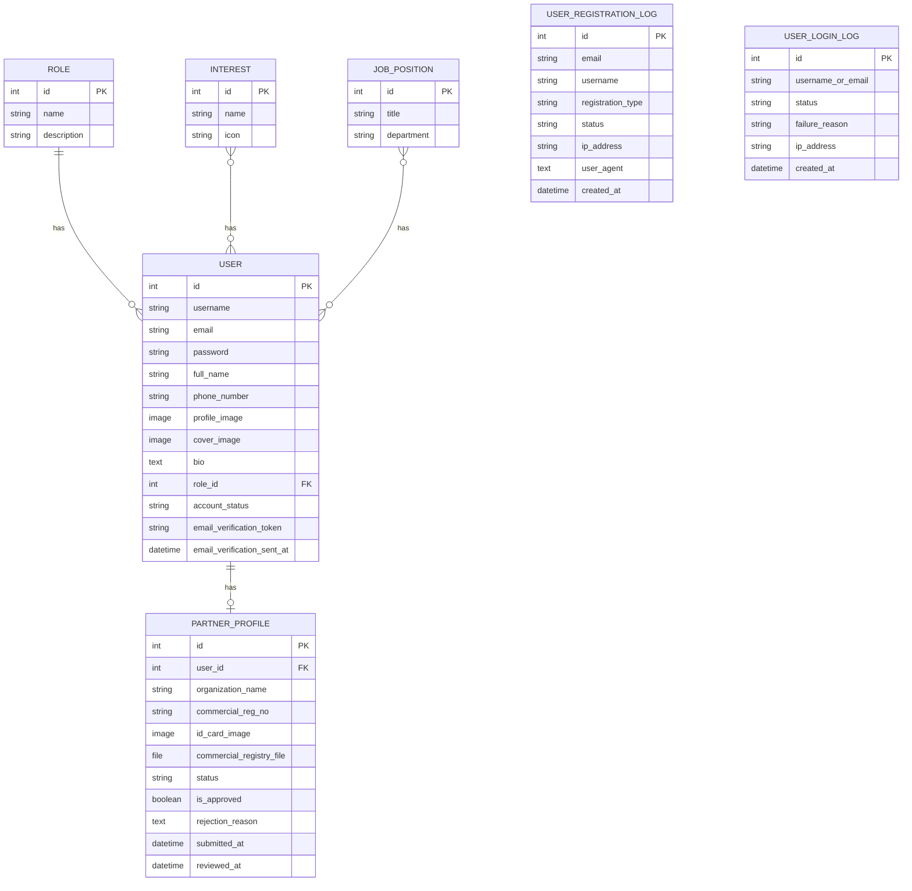

# 📊 مخطط علاقات الكيانات (ERD) - دليل إب السياحي

> **Entity Relationship Diagram - Ibb Tourist Guide**

---

## 📋 فهرس المخططات

1. [ERD الشامل](#erd-الشامل)
2. [تطبيق المستخدمين](#erd-المستخدمين)
3. [تطبيق الأماكن](#erd-الأماكن)
4. [تطبيق التفاعلات](#erd-التفاعلات)
5. [تطبيق الإدارة](#erd-الإدارة)
6. [جداول التفاصيل](#جداول-التفاصيل)

---

# 🗄️ ERD الشامل

```
┌─────────────────────────────────────────────────────────────────────────────────────────────────────┐
│                                    مخطط العلاقات الشامل                                             │
├─────────────────────────────────────────────────────────────────────────────────────────────────────┤
│                                                                                                     │
│  ┌─────────────┐          ┌─────────────┐          ┌─────────────┐          ┌─────────────┐        │
│  │    Role     │          │   Interest  │          │ JobPosition │          │  Category   │        │
│  │─────────────│          │─────────────│          │─────────────│          │─────────────│        │
│  │ PK: id      │          │ PK: id      │          │ PK: id      │          │ PK: id      │        │
│  │ name        │          │ name        │          │ title       │          │ name        │        │
│  │ description │          │ icon        │          │ department  │          │ icon        │        │
│  │ permissions │          └──────┬──────┘          └──────┬──────┘          │ FK: parent  │◄──┐    │
│  └──────┬──────┘                 │ M:N                    │ M:N             └──────┬──────┘   │    │
│         │ 1:N                    │                        │                        │ 1:N      │    │
│         │                        │                        │                        │          │    │
│         ▼                        ▼                        ▼                        ▼          │    │
│  ╔═══════════════════════════════════════════════════════════════════╗                        │    │
│  ║                              USER                                 ║                        │    │
│  ║═══════════════════════════════════════════════════════════════════║                        │    │
│  ║ PK: id                                                            ║                        │    │
│  ║ username, email, password                                         ║                        │    │
│  ║ full_name, phone_number                                           ║                        │    │
│  ║ profile_image, cover_image, bio                                   ║                        │    │
│  ║ FK: role_id ─────────────────────────────────────────────────────►║                        │    │
│  ║ account_status (active/pending/rejected/suspended)                ║                        │    │
│  ║ email_verification_token, email_verification_sent_at              ║                        │    │
│  ║ fcm_token                                                         ║                        │    │
│  ║ M:N interests ────────────────────────────────────────────────────║                        │    │
│  ║ M:N job_positions ────────────────────────────────────────────────║                        │    │
│  ╚════════════════════════════════╤══════════════════════════════════╝                        │    │
│                                   │                                                            │    │
│         ┌─────────────────────────┼─────────────────────────────────┐                         │    │
│         │ 1:1                     │ 1:N                             │ 1:N                     │    │
│         ▼                         ▼                                 ▼                         │    │
│  ┌─────────────────┐    ┌─────────────────┐              ┌─────────────────┐                  │    │
│  │ PartnerProfile  │    │   Notification  │              │    Favorite     │                  │    │
│  │─────────────────│    │─────────────────│              │─────────────────│                  │    │
│  │ PK: id          │    │ PK: id          │              │ PK: id          │                  │    │
│  │ FK: user_id     │    │ FK: recipient   │              │ FK: user_id     │                  │    │
│  │ organization    │    │ type            │              │ FK: place_id    │──────────┐       │    │
│  │ commercial_reg  │    │ title, message  │              │ created_at      │          │       │    │
│  │ status          │    │ is_read         │              └─────────────────┘          │       │    │
│  │ is_approved     │    │ action_url      │                                           │       │    │
│  └────────┬────────┘    └─────────────────┘              ┌─────────────────┐          │       │    │
│           │                                              │     Review      │          │       │    │
│           │ 1:N                                          │─────────────────│          │       │    │
│           │                                              │ PK: id          │          │       │    │
│           ▼                                              │ FK: user_id     │          │       │    │
│  ╔═══════════════════════════════════════════════════════│ FK: place_id    │──────────┤       │    │
│  ║                   ESTABLISHMENT                       │ rating (1-5)    │          │       │    │
│  ║═══════════════════════════════════════════════════════│ comment         │          │       │    │
│  ║ PK: id (inherits from Place)                         │ is_approved     │          │       │    │
│  ║ FK: owner_id (User) ◄────────────────────────────────└─────────────────┘          │       │    │
│  ║ FK: category_id ─────────────────────────────────────────────────────────────────►│       │    │
│  ║ price_range, working_hours                                                        │       │    │
│  ║ approval_status                                                                   │       │    │
│  ║ phone, email, website                                                             ▼       │    │
│  ╚═══════════════════════════════════════════════════════════════════════════════════════════│    │
│           │                                                                                  │    │
│           │ 1:N                              ╔════════════════════════════════════════╗      │    │
│           ▼                                  ║                PLACE                   ║◄─────┘    │
│  ┌─────────────────┐                        ║════════════════════════════════════════║           │
│  │EstablishmentUnit│                        ║ PK: id                                 ║           │
│  │─────────────────│                        ║ name, name_en                          ║           │
│  │ PK: id          │                        ║ description                            ║           │
│  │ FK: establishment                        ║ place_type                             ║           │
│  │ name            │                        ║ FK: category_id ──────────────────────►║───────────┘
│  │ unit_type       │                        ║ latitude, longitude                    ║
│  │ capacity        │                        ║ address                                ║
│  │ price           │                        ║ cover_image                            ║
│  │ is_available    │                        ║ is_active, is_featured                 ║
│  └─────────────────┘                        ╚════════════════════════════════════════╝
│                                                              ▲
│                                                              │ Inherits
│                                              ┌───────────────┴───────────────┐
│                                              │                               │
│                                     ┌────────┴────────┐             ┌────────┴────────┐
│                                     │    LANDMARK     │             │  SERVICE_POINT  │
│                                     │─────────────────│             │─────────────────│
│                                     │ historical_period              │ service_type   │
│                                     │ cultural_sig    │             │ operating_hours │
│                                     │ visiting_tips   │             └─────────────────┘
│                                     └─────────────────┘
│                                                                                                     │
└─────────────────────────────────────────────────────────────────────────────────────────────────────┘
```

---

# 👥 ERD المستخدمين



---

## 📋 جدول كيانات المستخدمين

| الكيان                  | الوصف            | المفتاح الرئيسي | المفاتيح الأجنبية |
| ----------------------- | ---------------- | --------------- | ----------------- |
| **User**                | المستخدم الرئيسي | id              | role_id           |
| **Role**                | الأدوار          | id              | -                 |
| **Interest**            | الاهتمامات       | id              | -                 |
| **JobPosition**         | المناصب          | id              | -                 |
| **PartnerProfile**      | ملف الشريك       | id              | user_id           |
| **UserRegistrationLog** | سجل التسجيل      | id              | -                 |
| **UserLoginLog**        | سجل الدخول       | id              | -                 |

---

# 📍 ERD الأماكن

```
┌─────────────────────────────────────────────────────────────────────────────────────┐
│                              ERD تطبيق الأماكن                                      │
├─────────────────────────────────────────────────────────────────────────────────────┤
│                                                                                     │
│  ┌─────────────────┐         1:N          ┌─────────────────┐                       │
│  │    CATEGORY     │◄─────────────────────│    CATEGORY     │ (Self Reference)      │
│  │─────────────────│                      │   (parent)      │                       │
│  │ PK: id          │                      └─────────────────┘                       │
│  │ name, name_en   │                                                                │
│  │ icon            │                                                                │
│  │ FK: parent_id   │                                                                │
│  │ order           │                                                                │
│  │ is_active       │                                                                │
│  └────────┬────────┘                                                                │
│           │                                                                         │
│           │ 1:N                                                                     │
│           ▼                                                                         │
│  ╔═════════════════════════════════════════════════════════════════════════════╗    │
│  ║                                 PLACE                                       ║    │
│  ║═════════════════════════════════════════════════════════════════════════════║    │
│  ║ PK: id                                                                      ║    │
│  ║ name, name_en                                                               ║    │
│  ║ description, description_en                                                 ║    │
│  ║ place_type (establishment/landmark/service_point)                           ║    │
│  ║ FK: category_id                                                             ║    │
│  ║ latitude, longitude                                                         ║    │
│  ║ address                                                                     ║    │
│  ║ cover_image                                                                 ║    │
│  ║ is_active, is_featured                                                      ║    │
│  ║ created_at, updated_at                                                      ║    │
│  ╚══════════════════════════╤══════════════════════════════════════════════════╝    │
│                             │                                                       │
│         ┌───────────────────┼───────────────────┬───────────────────┐               │
│         │ Inherits          │ Inherits          │ Inherits          │               │
│         ▼                   ▼                   ▼                   │               │
│  ┌─────────────────┐ ┌─────────────────┐ ┌─────────────────┐        │               │
│  │  ESTABLISHMENT  │ │    LANDMARK     │ │  SERVICE_POINT  │        │               │
│  │─────────────────│ │─────────────────│ │─────────────────│        │               │
│  │ FK: owner_id    │ │ historical_period│ service_type    │        │               │
│  │ price_range     │ │ cultural_sig    │ │ operating_hours │        │               │
│  │ working_hours   │ │ visiting_tips   │ │ is_24_hours     │        │               │
│  │ approval_status │ │ best_time_visit │ │                 │        │               │
│  │ phone, email    │ │                 │ │                 │        │               │
│  └────────┬────────┘ └─────────────────┘ └─────────────────┘        │               │
│           │                                                         │               │
│           │ 1:N                                               1:N   │               │
│           ▼                                                         ▼               │
│  ┌─────────────────┐                                    ┌─────────────────┐         │
│  │ESTABLISHMENT_UNIT                                    │   PLACE_MEDIA   │         │
│  │─────────────────│                                    │─────────────────│         │
│  │ PK: id          │                                    │ PK: id          │         │
│  │ FK: establishment                                    │ FK: place_id    │         │
│  │ name            │                                    │ file            │         │
│  │ unit_type       │                                    │ media_type      │         │
│  │ capacity        │                                    │ caption         │         │
│  │ price           │                                    │ order           │         │
│  │ is_available    │                                    │                 │         │
│  │ description     │                                    │                 │         │
│  └─────────────────┘                                    └─────────────────┘         │
│                                                                                     │
│  ┌─────────────────┐                      ┌─────────────────┐                       │
│  │   AMENITY       │ M:N                  │  TOURIST_ROUTE  │                       │
│  │─────────────────│◄────────────────────►│─────────────────│                       │
│  │ PK: id          │                      │ PK: id          │                       │
│  │ name            │                      │ name            │                       │
│  │ icon            │                      │ description     │                       │
│  │ category        │                      │ difficulty      │                       │
│  └─────────────────┘                      │ duration_hours  │                       │
│                                           │ distance_km     │                       │
│                                           └────────┬────────┘                       │
│                                                    │ 1:N                            │
│                                                    ▼                                │
│                                           ┌─────────────────┐                       │
│                                           │ ROUTE_WAYPOINT  │                       │
│                                           │─────────────────│                       │
│                                           │ PK: id          │                       │
│                                           │ FK: route_id    │                       │
│                                           │ FK: place_id    │                       │
│                                           │ order           │                       │
│                                           │ duration_minutes│                       │
│                                           └─────────────────┘                       │
│                                                                                     │
└─────────────────────────────────────────────────────────────────────────────────────┘
```

---

## 📋 جدول كيانات الأماكن

| الكيان                | الوصف         | المفتاح الرئيسي | المفاتيح الأجنبية  | نوع العلاقة    |
| --------------------- | ------------- | --------------- | ------------------ | -------------- |
| **Category**          | الفئات        | id              | parent_id          | Self 1:N       |
| **Place**             | المكان (مجرد) | id              | category_id        | 1:N            |
| **Establishment**     | منشأة         | id              | owner_id           | Inherits Place |
| **Landmark**          | معلم          | id              | -                  | Inherits Place |
| **ServicePoint**      | نقطة خدمة     | id              | -                  | Inherits Place |
| **EstablishmentUnit** | وحدة          | id              | establishment_id   | N:1            |
| **PlaceMedia**        | وسائط         | id              | place_id           | N:1            |
| **Amenity**           | مرافق         | id              | -                  | M:N with Place |
| **TouristRoute**      | مسار          | id              | -                  | 1:N            |
| **RouteWaypoint**     | نقطة مسار     | id              | route_id, place_id | N:1            |

---

# 💬 ERD التفاعلات

```
┌─────────────────────────────────────────────────────────────────────────────────────┐
│                            ERD تطبيق التفاعلات                                      │
├─────────────────────────────────────────────────────────────────────────────────────┤
│                                                                                     │
│                          ┌─────────────────┐                                        │
│                          │      USER       │                                        │
│                          │─────────────────│                                        │
│                          │ PK: id          │                                        │
│                          └────────┬────────┘                                        │
│                                   │                                                 │
│     ┌──────────────┬──────────────┼──────────────┬──────────────┬───────────────┐   │
│     │ 1:N          │ 1:N          │ 1:N          │ 1:N          │ 1:N           │   │
│     ▼              ▼              ▼              ▼              ▼               │   │
│ ┌────────┐   ┌────────┐    ┌────────┐    ┌────────┐    ┌────────────┐           │   │
│ │FAVORITE│   │ REVIEW │    │ITINERARY   │ REPORT │    │NOTIFICATION│           │   │
│ │────────│   │────────│    │────────│    │────────│    │────────────│           │   │
│ │ PK: id │   │ PK: id │    │ PK: id │    │ PK: id │    │ PK: id     │           │   │
│ │FK:user │   │FK:user │    │FK:user │    │FK:reporter  │FK:recipient│           │   │
│ │FK:place│   │FK:place│    │ title  │    │content_type│ type       │           │   │
│ │created │   │ rating │    │start_dt│    │ object_id  │ title      │           │   │
│ └────────┘   │ comment│    │end_date│    │ reason     │ message    │           │   │
│              │approved│    │is_public   │ status     │ is_read    │           │   │
│              └────────┘    └───┬────┘    └────────┘    │ action_url │           │   │
│                                │ 1:N                   └────────────┘           │   │
│                                ▼                                                │   │
│                         ┌──────────────┐                                        │   │
│                         │ITINERARY_ITEM│                                        │   │
│                         │──────────────│                                        │   │
│                         │ PK: id       │                                        │   │
│                         │FK: itinerary │                                        │   │
│                         │ FK: place_id │                                        │   │
│                         │ day_number   │                                        │   │
│                         │ visit_time   │                                        │   │
│                         │ notes        │                                        │   │
│                         └──────────────┘                                        │   │
│                                                                                 │   │
│ ┌──────────────────┐    ┌──────────────────┐    ┌──────────────────┐           │   │
│ │  PLACE_COMMENT   │    │ESTABLISHMENT_FOLLOW   │NOTIFICATION_PREF │           │   │
│ │──────────────────│    │──────────────────│    │──────────────────│           │   │
│ │ PK: id           │    │ PK: id           │    │ PK: id           │           │   │
│ │ FK: user_id      │    │ FK: user_id      │    │ FK: user_id      │           │   │
│ │ FK: place_id     │    │FK: establishment │    │ push_enabled     │           │   │
│ │ content          │    │ created_at       │    │ email_enabled    │           │   │
│ │ created_at       │    │                  │    │ types_enabled    │           │   │
│ └──────────────────┘    └──────────────────┘    └──────────────────┘           │   │
│                                                                                 │   │
│ ┌──────────────────┐                                                           │   │
│ │   SYSTEM_ALERT   │                                                           │   │
│ │──────────────────│                                                           │   │
│ │ PK: id           │                                                           │   │
│ │ title            │                                                           │   │
│ │ message          │                                                           │   │
│ │ alert_type       │                                                           │   │
│ │ severity         │                                                           │   │
│ │ is_active        │                                                           │   │
│ └──────────────────┘                                                           │   │
│                                                                                     │
└─────────────────────────────────────────────────────────────────────────────────────┘
```

---

## 📋 جدول كيانات التفاعلات

| الكيان                     | الوصف      | المفتاح الرئيسي | المفاتيح الأجنبية         |
| -------------------------- | ---------- | --------------- | ------------------------- |
| **Favorite**               | مفضلة      | id              | user_id, place_id         |
| **Review**                 | تقييم      | id              | user_id, place_id         |
| **Itinerary**              | جدول رحلة  | id              | user_id                   |
| **ItineraryItem**          | عنصر جدول  | id              | itinerary_id, place_id    |
| **Report**                 | بلاغ       | id              | reporter_id               |
| **PlaceComment**           | تعليق      | id              | user_id, place_id         |
| **EstablishmentFollow**    | متابعة     | id              | user_id, establishment_id |
| **Notification**           | إشعار      | id              | recipient_id              |
| **NotificationPreference** | تفضيلات    | id              | user_id                   |
| **SystemAlert**            | تنبيه نظام | id              | -                         |

---

# ⚙️ ERD الإدارة

```
┌─────────────────────────────────────────────────────────────────────────────────────┐
│                              ERD تطبيق الإدارة                                      │
├─────────────────────────────────────────────────────────────────────────────────────┤
│                                                                                     │
│  ┌─────────────────┐                              ┌─────────────────┐               │
│  │      USER       │                              │  ESTABLISHMENT  │               │
│  │─────────────────│                              │─────────────────│               │
│  └────────┬────────┘                              └────────┬────────┘               │
│           │ 1:N                                            │                        │
│           ▼                                                │                        │
│  ╔═════════════════════════════════════════════════════════╧════════════════╗       │
│  ║                          ADVERTISEMENT                                   ║       │
│  ║══════════════════════════════════════════════════════════════════════════║       │
│  ║ PK: id                                                                   ║       │
│  ║ FK: owner_id (User)                                                      ║       │
│  ║ FK: establishment_id (Optional)                                          ║       │
│  ║ title                                                                    ║       │
│  ║ description                                                              ║       │
│  ║ image                                                                    ║       │
│  ║ target_url                                                               ║       │
│  ║ ad_type (banner/featured/sponsored)                                      ║       │
│  ║ status (pending/approved/rejected/active/expired)                        ║       │
│  ║ start_date, end_date                                                     ║       │
│  ║ impressions, clicks                                                      ║       │
│  ╚═══════════════════════════════════════════════════════════════════╤══════╝       │
│                                                                      │ 1:N          │
│  ┌─────────────────┐    ┌─────────────────┐                         ▼              │
│  │     REQUEST     │    │  AD_DAILY_STATS │                  ┌─────────────┐       │
│  │─────────────────│    │─────────────────│                  │   INVOICE   │       │
│  │ PK: id          │    │ PK: id          │                  │─────────────│       │
│  │ FK: requester   │    │ FK: ad_id       │                  │ PK: id      │       │
│  │ request_type    │    │ date            │                  │ FK: ad_id   │       │
│  │ status          │    │ impressions     │                  │ amount      │       │
│  │ content_type    │    │ clicks          │                  │ status      │       │
│  │ object_id       │    │ ctr             │                  │ due_date    │       │
│  │ created_at      │    └─────────────────┘                  └─────────────┘       │
│  └─────────────────┘                                                               │
│                                                                                     │
│  ┌─────────────────┐    ┌─────────────────┐    ┌─────────────────┐                 │
│  │ EMERGENCY_ALERT │    │EMERGENCY_CONTACT│    │  WEATHER_ALERT  │                 │
│  │─────────────────│    │─────────────────│    │─────────────────│                 │
│  │ PK: id          │    │ PK: id          │    │ PK: id          │                 │
│  │ title           │    │ name            │    │ title           │                 │
│  │ message         │    │ phone           │    │ message         │                 │
│  │ alert_type      │    │ category        │    │ severity        │                 │
│  │ severity        │    │ is_active       │    │ is_active       │                 │
│  │ is_active       │    └─────────────────┘    └─────────────────┘                 │
│  └─────────────────┘                                                               │
│                                                                                     │
│  ┌─────────────────┐    ┌─────────────────┐    ┌─────────────────┐                 │
│  │   HERO_SLIDE    │    │   SITE_SETTING  │    │      MENU       │                 │
│  │─────────────────│    │─────────────────│    │─────────────────│                 │
│  │ PK: id          │    │ PK: id          │    │ PK: id          │                 │
│  │ title           │    │ key             │    │ name            │                 │
│  │ subtitle        │    │ value           │    │ location        │                 │
│  │ image           │    │ value_type      │    │ is_active       │                 │
│  │ button_text     │    └─────────────────┘    └─────────────────┘                 │
│  │ button_url      │                                                               │
│  │ order           │    ┌─────────────────┐    ┌─────────────────┐                 │
│  │ is_active       │    │   AUDIT_LOG     │    │FEATURE_TOGGLE   │                 │
│  └─────────────────┘    │─────────────────│    │─────────────────│                 │
│                         │ PK: id          │    │ PK: id          │                 │
│                         │ FK: user_id     │    │ feature_name    │                 │
│                         │ action          │    │ is_enabled      │                 │
│                         │ model_name      │    │ description     │                 │
│                         │ object_id       │    └─────────────────┘                 │
│                         │ changes (JSON)  │                                        │
│                         │ created_at      │                                        │
│                         └─────────────────┘                                        │
│                                                                                     │
└─────────────────────────────────────────────────────────────────────────────────────┘
```

---

## 📋 جدول كيانات الإدارة

| الكيان               | الوصف          | المفتاح الرئيسي | المفاتيح الأجنبية          |
| -------------------- | -------------- | --------------- | -------------------------- |
| **Advertisement**    | إعلان          | id              | owner_id, establishment_id |
| **Request**          | طلب موافقة     | id              | requester_id               |
| **Invoice**          | فاتورة         | id              | advertisement_id           |
| **AdDailyStats**     | إحصائيات يومية | id              | advertisement_id           |
| **EmergencyAlert**   | تنبيه طوارئ    | id              | -                          |
| **EmergencyContact** | جهة طوارئ      | id              | -                          |
| **WeatherAlert**     | تنبيه طقس      | id              | -                          |
| **HeroSlide**        | شريحة رئيسية   | id              | -                          |
| **SiteSetting**      | إعداد موقع     | id              | -                          |
| **Menu**             | قائمة          | id              | -                          |
| **AuditLog**         | سجل تدقيق      | id              | user_id                    |
| **FeatureToggle**    | تفعيل ميزة     | id              | -                          |

---

# 📊 ملخص العلاقات

## أنواع العلاقات

| الرمز | المعنى             |
| ----- | ------------------ |
| `1:1` | علاقة واحد لواحد   |
| `1:N` | علاقة واحد لمتعدد  |
| `N:1` | علاقة متعدد لواحد  |
| `M:N` | علاقة متعدد لمتعدد |
| `PK`  | المفتاح الرئيسي    |
| `FK`  | المفتاح الأجنبي    |

## إحصائيات الكيانات

| التطبيق          | عدد الكيانات |
| ---------------- | ------------ |
| **users**        | 7            |
| **places**       | 10           |
| **interactions** | 10           |
| **management**   | 12           |
| **المجموع**      | **39 كيان**  |

---

> **تاريخ الإنشاء**: 2026-02-08
> **نسخة المخطط**: 1.0
